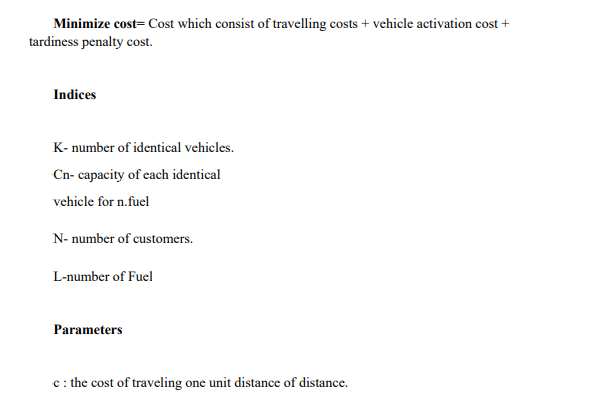
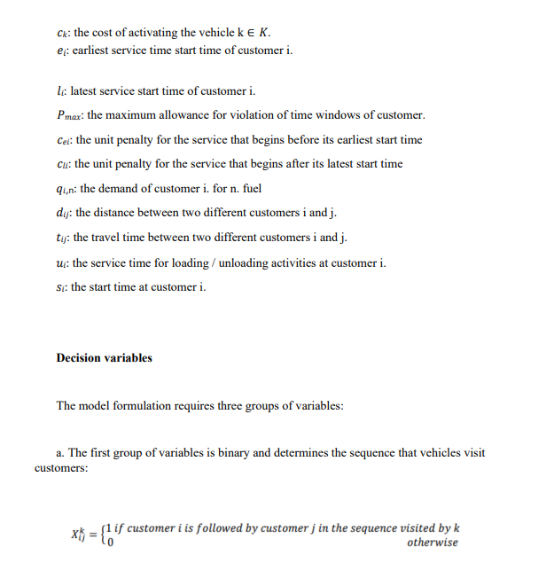
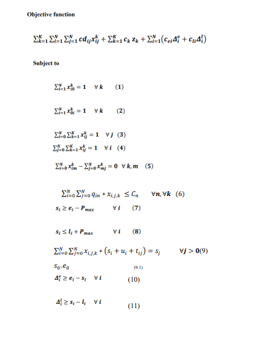
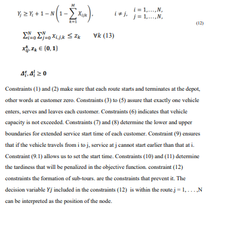

# Freelancer Project
## VRPFTW-by-gurobi

```
Vehicle Routing roblem
```

### Project description
```
Problem statement: The problem encountered at the NAFTAL company is exactly a 
vehicle routing problem with flexible time windows. From a central depot CHIFFA 
(fuel distribution center), there are 30 trucks of homogeneous and limited capacity, the 
role of these trucks is to distribute and deliver fuels (gasoline-normal, without -plumb, 
diesel) to their customers. NAFTAL's customers are either: (service stations, police 
stations, hospitals, etc..) each customer is characterized by geographic coordinates (x, 
y), and by a demand d, defined, and by a time window ai, bi every customer desire to
be served in his windows of time. it happens where the trucks can arrive earlier or before 
the opening of the service at this customer so he must wait for the start of the time 
window before starting the service. The objective of this problem is to find all the routes 
that can be carried out to meet customer demands while minimizing the total distance 
traveled by the trucks, while respecting the following constraints:
.Each customer must be served once and only once by a single vehicle.
.Each routing begins and ends at the depot.
.The capacity of vehicles must not be exceeded.
.The time windows for each client must be respected.


```
### Mat model of problem









